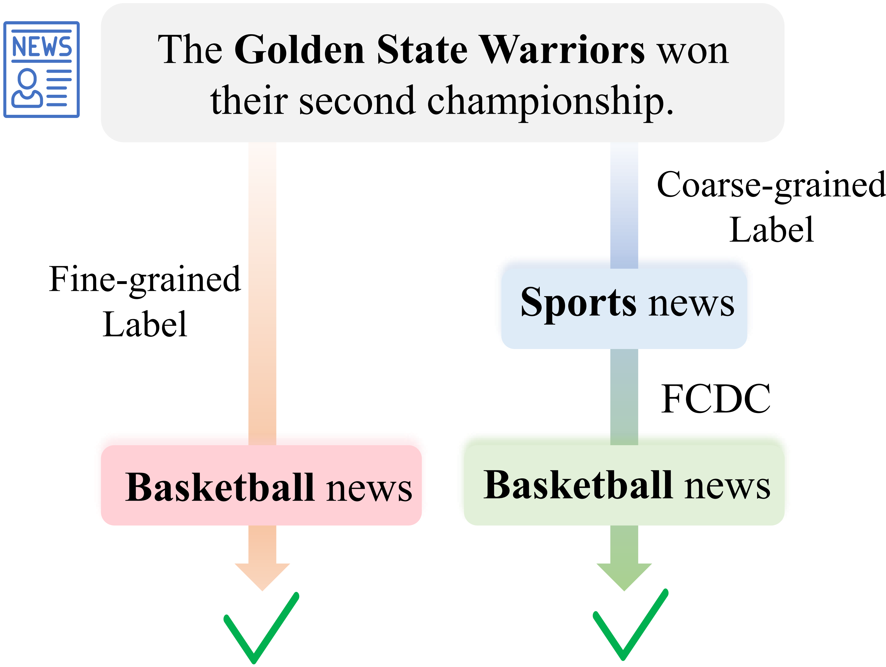
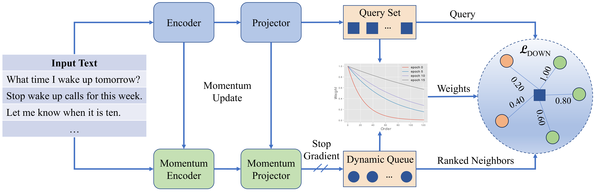
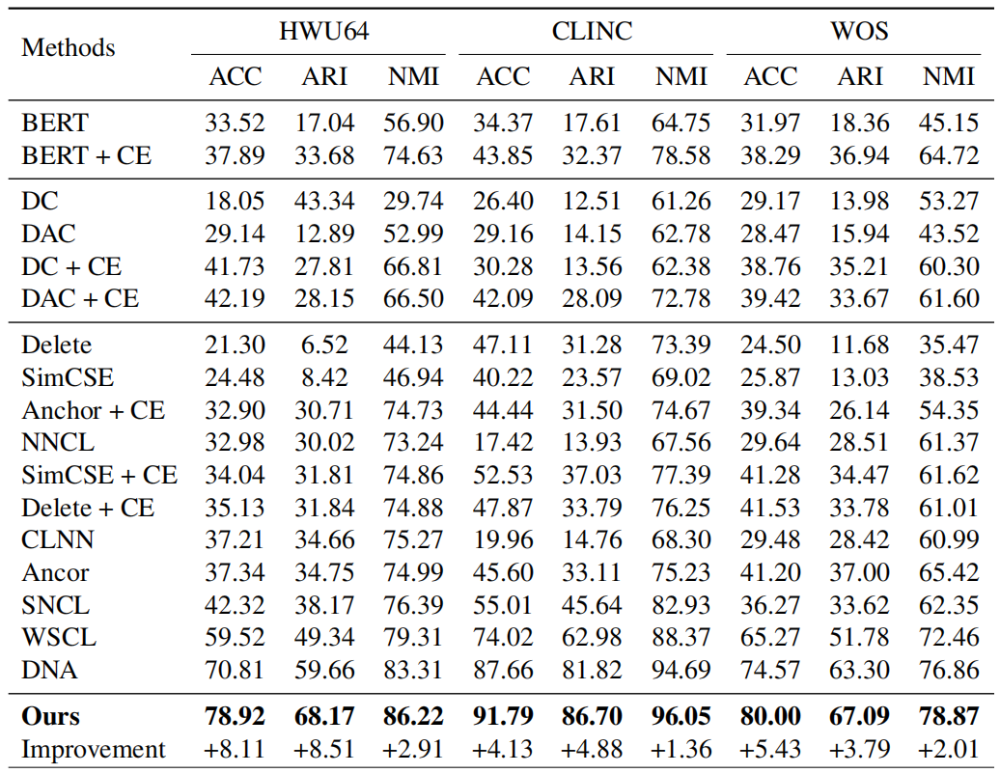

# Dynamic Order Weighted Network (DOWN)
Data and code for paper titled [DOWN: Dynamic Order Weighted Network for Fine-grained Category Discovery](https://www.sciencedirect.com/science/article/abs/pii/S0950705124003010) (Knowledge-based Systems 2024 paper)

*Fine-grained Category Discovery* aims to discover novel fine-grained categories automatically from the coarse-grained labeled data, which can bridge the gap between the demand for fine-grained analysis and the high annotation cost.
<div align=center>

</div>


## Contents
[1. Data](#data)

[2. Model](#model)

[3. Requirements](#requirements)

[4. Running](#running)

[5. Results](#results)

[6. Thanks](#thanks)

[6. Citation](#citation)

## Data
We performed experiments on three public datasets: [clinc](https://aclanthology.org/D19-1131/), [wos](https://arxiv.org/abs/1709.08267) and [hwu64](https://arxiv.org/abs/1903.05566), which have been included in our repository in the data folder './data'.

## Model
Our model mainly contains three steps. First, we maintain a dynamic queue to retrieve neighbors for queries based on their semantic similarities. Second, we sort the retrieved neighbors based on semantic similarity. Third, we introduce a weighting mechanism with dynamic exponential decay functions for the sorted neighbors based on order distances.
<div align=center>

</div>

## Requirements
* python==3.8
* pytorch==1.11.0
* transformers==4.15.0
* scipy==1.9.3
* numpy==1.23.5
* scikit-learn==1.2.0
* faiss-gpu==1.7.2

## Running
Training and testing our model through the bash scripts:
```
sh run.sh
```
You can also add or change parameters in run.sh. (More parameters are listed in init_parameter.py)

## Results
<div align=center>

</div>
It should be noted that the experimental results may be slightly different because of the randomness of clustering when testing.

## Thanks
Some code references the following repositories:
* [DNA](https://github.com/Lackel/DNA)
* [HW-SCL](https://github.com/Lackel/Hierarchical_Weighted_SCL)
* [MTP-CLNN](https://github.com/fanolabs/NID_ACLARR2022)

## Citation
If our paper or code is helpful to you, please consider citing our paper:
```
@article{an2024down,
  title={DOWN: Dynamic Order Weighted Network for Fine-grained Category Discovery},
  author={An, Wenbin and Tian, Feng and Shi, Wenkai and Lin, Haonan and Wu, Yaqiang and Cai, Mingxiang and Wang, Luyan and Wen, Hua and Yao, Lei and Chen, Ping},
  journal={Knowledge-Based Systems},
  pages={111666},
  year={2024},
  publisher={Elsevier}
}
```